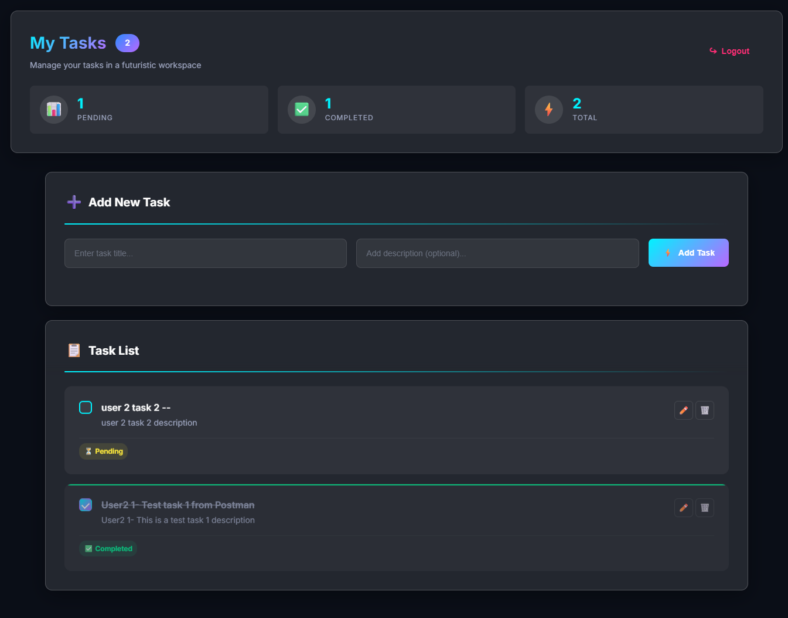

# Task Manager App

A full-stack task management application built with the MERN stack.

## ✨ Features

- Secure JWT authentication (login/register)
- Create, read, update, delete tasks
- Mark tasks as complete/incomplete
- Responsive UI with real-time updates
- Optimistic UI for smooth UX
- Toast notifications for feedback

## 🛠 Tech Stack

- **Frontend**: React, Vite, Axios, Context API
- **Backend**: Node.js, Express, MongoDB (Atlas)
- **Deployment**: Vercel (frontend), Railway (backend)
- **Auth**: JWT, bcrypt, protected routes, Zod

## 🚀 Live Demo

- **Web App**: https://task-manager-app-wine-one.vercel.app

## 📥 Local Setup

1. Clone repo
2. `cd server && npm install`
3. Create `.env` with `MONGO_URI` and `JWT_TOKEN_SECRET`
4. `npm run dev`
5. `cd client && npm install && npm run dev`
